# Plan: Update Pipeline for Expanded Scoring Prompt Schema

**Status:** Updated / Awaiting Approval (v3)
**Date:** 2026-06-11

---

## 1. Summary

The [`config/scoring_prompt.md`](config/scoring_prompt.md) has been updated to require two new properties in the DeepSeek scoring response JSON:

| Property | Type | Description |
|---|---|---|
| `critical_keywords` | string | Comma-separated list of 3–5 role-specific technical terms with no direct match in the candidate's history |
| `over_qualified` | boolean | Whether the over-qualification reduction rule was triggered |

This plan:
1. Updates the **data model** [`src/models/scoredJob.js`](src/models/scoredJob.js) to parse and validate both new fields
2. Updates the **scoring orchestrator** [`score.js`](score.js) to pass new fields through SSE events
3. Updates the **stack rank formatter** [`src/models/stackRank.js`](src/models/stackRank.js) for the over-qualified hazard marker and to render `critical_keywords` as a machine-readable field
4. Updates the **stack rank parser** [`src/models/stackRank.js`](src/models/stackRank.js) to extract `criticalKeywords` from the markdown
5. Updates **`generate.js`** [`generate.js`](generate.js) to pass `criticalKeywords` through `buildScoredJobLike()`
6. Updates **`src/lib/promptBuilder.js`** to include `criticalKeywords` in resume and cover letter prompt payloads
7. Updates all **test fixtures, mocks, and unit tests**

---

## 2. Files to Modify

### 2.1 `src/models/scoredJob.js` — Model Parsing

**`parseScoreResponse(rawResponse)`** — Add two new soft-fail validation blocks (warn + default, never throw):

```javascript
// After existing matchedPillars block (line ~69), add:

// 10. critical_keywords — warn + default on failure, never throw
let criticalKeywords = '';
if (typeof parsed.critical_keywords === 'string' && parsed.critical_keywords.trim() !== '') {
  criticalKeywords = parsed.critical_keywords;
} else {
  process.emitWarning('critical_keywords is missing or empty — defaulting to empty string');
}

// 11. over_qualified — warn + default on failure, never throw
let overQualified = false;
if (typeof parsed.over_qualified === 'boolean') {
  overQualified = parsed.over_qualified;
} else if (parsed.over_qualified !== undefined && parsed.over_qualified !== null) {
  // Coerce truthy/falsy non-boolean values (e.g., "true", 1)
  overQualified = Boolean(parsed.over_qualified);
  process.emitWarning(`over_qualified received non-boolean value — coerced to ${overQualified}`);
} else {
  process.emitWarning('over_qualified is missing — defaulting to false');
}
```

**Return value** — Add both fields to the returned object:

```javascript
return {
  score: parsed.score,
  fitSignal: parsed.fit_signal,
  gap: parsed.gap,
  mustHaves: mustHaves,
  targetArchetype: targetArchetype,
  matchedPillars: matchedPillars,
  criticalKeywords: criticalKeywords,
  overQualified: overQualified,
};
```

**`createScoredJob()`** — Update the JSDoc `@param` to include:

```
@param {{ ... , criticalKeywords: string, overQualified: boolean }} scoreResult
```

No runtime changes needed — the spread operator `...scoreResult` already binds new fields.

### 2.2 `score.js` — Orchestrator SSE Broadcast

Update the `job_scored` broadcast payload (lines 145–158) to pass through the two new fields:

```javascript
broadcastEvent('job_scored', {
  rank: null,
  score: scoredJob.score,
  company: scoredJob.company,
  title: scoredJob.title,
  actionFlag: null,
  fitSignal: scoredJob.fitSignal,
  gap: scoredJob.gap,
  criticalKeywords: scoredJob.criticalKeywords,   // NEW
  overQualified: scoredJob.overQualified,           // NEW
  sourceFilename: scoredJob.filename,
  salary: scoredJob.salary,
  location: scoredJob.location,
  url: scoredJob.url,
  linkedInJobId: scoredJob.linkedInJobId,
});
```

No changes to the error/`job_skipped` path — exceptions from `parseScoreResponse` already bubble up to the existing `try/catch` at line 132 and trigger `job_skipped` correctly.

### 2.3 `src/models/stackRank.js` — Markdown Formatter (2 changes)

**Change A: Over-qualified hazard marker on Gap line**

In [`formatStackRank()`](src/models/stackRank.js:42), inside the per-job loop, replace the hardcoded Gap line with a conditional:

```javascript
// Replace: lines.push(`**Gap:** ${job.gap}`);
// With:
let gapLine = `**Gap:** ${job.gap}`;
if (job.overQualified === true) {
  gapLine += ' ⚠️ OVER-QUALIFIED';
}
lines.push(gapLine);
```

**Change B: Critical Keywords line in each job entry**

Add a new line after the "Pillar Library Matches" line (current line ~99):

```javascript
// Add after: lines.push(`**Pillar Library Matches:** ${pillarStr}`);
lines.push(`**Critical Keywords:** ${job.criticalKeywords || '—'}`);
```

This makes `critical_keywords` flow through the stack rank markdown so it can be extracted by `parseStackRank` and consumed by `generate.js`.

### 2.4 `src/models/stackRank.js` — Markdown Parser

In [`parseStackRank()`](src/models/stackRank.js:114), add extraction for `criticalKeywords` from the body of each job entry:

```javascript
// After the existing urlMatch extraction (line ~150):
const keywordsMatch = body.match(/\*\*Critical Keywords:\*\* (.+)/);
const criticalKeywords = keywordsMatch ? keywordsMatch[1].trim() : '';
```

Include `criticalKeywords` in the returned entry object:

```javascript
entries.push({
  rank,
  score,
  actionFlag,
  company,
  title,
  url,
  linkedInJobId,
  sourceFilename,
  criticalKeywords,   // NEW
});
```

**Impact on `parseStackRank` tests:** Existing round-trip tests will pass because they already render `**Critical Keywords:**` via the formatter (since `makeScoredJob` provides `criticalKeywords`). However, the returned entry will now include a `criticalKeywords` field, so existing `toMatchObject` assertions may need updating if they use exact matching. The existing tests use `toMatchObject` with partial patterns, so they should be fine — but a new round-trip assertion for `criticalKeywords` will be added.

### 2.5 `generate.js` — `buildScoredJobLike()` + `outputInstruction`

**`buildScoredJobLike()`** (line 119): Add `criticalKeywords` from the `qualifyingJob`:

```javascript
function buildScoredJobLike(qualifyingJob, jobFile, fitSignal, gap) {
  return {
    ...jobFile,
    score: qualifyingJob.score,
    fitSignal,
    gap,
    rank: qualifyingJob.rank,
    actionFlag: qualifyingJob.actionFlag,
    criticalKeywords: qualifyingJob.criticalKeywords || '',   // NEW
  };
}
```

### 2.6 `src/lib/promptBuilder.js` — Prompt Assembly

**`buildResumePrompt()`** — Add `criticalKeywords` section after the gap line (if present):

```javascript
// After the GAP: line (line ~98), add:
if (scoredJob.criticalKeywords) {
  parts.push('', 'CRITICAL KEYWORDS TO WEAVE:', '');
  parts.push(scoredJob.criticalKeywords);
}
```

**`buildCoverLetterPrompt()`** — Add `criticalKeywords` section after the generated resume:

```javascript
// After the GENERATED RESUME: section, add:
if (scoredJob.criticalKeywords) {
  parts.push('', 'CRITICAL KEYWORDS TO WEAVE:', '');
  parts.push(scoredJob.criticalKeywords);
}
```

**`buildQualityPrompt()`** — Add `criticalKeywords` section after the job description.

Currently this function returns a static array. Convert to a mutable `parts` array so we can conditionally add the keywords section:

```javascript
function buildQualityPrompt(scoredJob, resumeContent, coverLetterContent) {
  // ... existing validation unchanged ...

  const parts = [
    'JOB DESCRIPTION:',
    '',
    scoredJob.description,
  ];

  if (scoredJob.criticalKeywords) {
    parts.push('', 'CRITICAL KEYWORDS TO WEAVE:', '');
    parts.push(scoredJob.criticalKeywords);
  }

  parts.push('', 'GENERATED RESUME:', '', resumeContent);
  parts.push('', 'GENERATED COVER LETTER:', '', coverLetterContent);

  return parts.join('\n');
}
```

### 2.7 `tests/fixtures/sample_deepseek_score_response.json` — Test Fixture

Replace the current minimal fixture with the full 8-property payload:

```json
{
  "score": 7,
  "fit_signal": "Strong alignment on governance program leadership and enterprise compliance scope. Meta experience maps directly to the regulatory delivery requirements.",
  "gap": "No direct healthcare domain experience.",
  "must_haves": "Healthcare privacy domain expertise, program-building at scale, executive stakeholder management",
  "target_archetype": "A hands-on governance program builder",
  "matched_pillars": ["Pillar 1", "Pillar 4", "Pillar 8"],
  "critical_keywords": "HIPAA, HITECH, CMS interoperability, healthcare data masking, EHR integration",
  "over_qualified": false
}
```

### 2.8 `tests/helpers/msw-setup.js` — MSW Mock Handler

Update the mock DeepSeek response (lines 21–25) to return the full 8-property payload:

```javascript
content: JSON.stringify({
  score: 7,
  fit_signal: 'Strong alignment on governance program leadership and enterprise compliance scope.',
  gap: 'No direct healthcare domain experience.',
  must_haves: 'Healthcare privacy domain expertise, program-building at scale',
  target_archetype: 'A hands-on governance program builder',
  matched_pillars: ['Pillar 1', 'Pillar 4'],
  critical_keywords: 'HIPAA, HITECH, EHR integration',
  over_qualified: false,
}),
```

### 2.9 `tests/unit/scoredJob.test.js` — Unit Tests

In the `parseScoreResponse` describe block, add:

| Test | Description |
|---|---|
| `parses critical_keywords from fixture` | Assert `result.criticalKeywords` is a non-empty string |
| `parses over_qualified from fixture` | Assert `result.overQualified` is `false` (from fixture) |
| `defaults critical_keywords to empty string when missing` | Payload omits `critical_keywords` → `result.criticalKeywords === ''` |
| `defaults over_qualified to false when missing` | Payload omits `over_qualified` → `result.overQualified === false` |
| `parses over_qualified as true when true` | Payload `over_qualified: true` → `result.overQualified === true` |
| `coerces over_qualified string "true" to boolean true` | Payload `over_qualified: "true"` → `result.overQualified === true` (with warning) |
| `defaults over_qualified to false when null` | Payload `over_qualified: null` → `result.overQualified === false` |

In the `createScoredJob` describe block:

| Test | Description |
|---|---|
| `binds criticalKeywords onto scored job` | Verify `scoredJob.criticalKeywords` is present |
| `binds overQualified onto scored job` | Verify `scoredJob.overQualified` is present |

Also **update the existing "parses valid fixture response correctly" test** (line 50) — the `toEqual` assertion must now include `criticalKeywords` and `overQualified` in the expected object.

### 2.10 `tests/unit/stackRank.test.js` — Unit Tests

In the `formatStackRank` describe block:

| Test | Description |
|---|---|
| `renders OVER-QUALIFIED marker when over_qualified is true` | `makeScoredJob({ overQualified: true })` → output contains `⚠️ OVER-QUALIFIED` |
| `does NOT render marker when over_qualified is false` | `makeScoredJob({ overQualified: false })` → output does NOT contain `⚠️ OVER-QUALIFIED` |
| `does NOT render marker when over_qualified is undefined` | `makeScoredJob({})` → output does NOT contain `⚠️ OVER-QUALIFIED` |
| `renders Critical Keywords field in each job entry` | `makeScoredJob({ criticalKeywords: 'HIPAA, HITECH' })` → output contains `**Critical Keywords:** HIPAA, HITECH` |
| `renders em-dash when criticalKeywords is empty` | `makeScoredJob({ criticalKeywords: '' })` → output contains `**Critical Keywords:** —` |

In the `parseStackRank` describe block:

| Test | Description |
|---|---|
| `extracts criticalKeywords from round-trip markdown` | Format then parse → `parsed[0].criticalKeywords` matches the original value |

Update the round-trip test (`round-trips with formatStackRank`, line 425) to also assert `criticalKeywords` in the `toMatchObject` expectation.

### 2.11 `tests/unit/promptBuilder.test.js` — Unit Tests

In all three describe blocks (`buildResumePrompt`, `buildCoverLetterPrompt`, `buildQualityPrompt`), add:

| Test | Description |
|---|---|
| `includes CRITICAL KEYWORDS section when criticalKeywords is present` | Verify output contains the section header and keyword values |
| `omits CRITICAL KEYWORDS section when criticalKeywords is empty` | Verify output does NOT contain the section |

The `makeScoredJob` helper in the test file will need to include `criticalKeywords: ''` by default (to preserve existing test behavior), with overrides in new tests.

---

## 3. Files NOT Modified (Rationale)

| File | Reason |
|---|---|
| `config/scoring_prompt.md` | Already updated by the user. Agent must never create/modify config files per AGENTS.md rule 9. |
| `config/adam_buteux_career.md` | Unchanged — no schema changes needed in career profile. |
| `src/lib/errors.js` | No new error types required — using existing `DeepSeekResponseError` and `process.emitWarning`. |
| `server/dashboard.html` | Not in scope — dashboard won't break; unknown fields are silently ignored by SSE consumers. |
| `tests/fixtures/sample_deepseek_score_invalid.json` | Already tests "missing score" case — no change needed. |

---

## 4. Execution Order

1. Update [`tests/fixtures/sample_deepseek_score_response.json`](tests/fixtures/sample_deepseek_score_response.json) — fixture first (establishes contract)
2. Update [`tests/helpers/msw-setup.js`](tests/helpers/msw-setup.js) — mock must match fixture
3. Update [`src/models/scoredJob.js`](src/models/scoredJob.js) — model parsing + validation
4. Update [`score.js`](score.js) — SSE broadcast payload
5. Update [`src/models/stackRank.js`](src/models/stackRank.js) — formatter (hazard marker + criticalKeywords line) + parser (extract criticalKeywords)
6. Update [`generate.js`](generate.js) — `buildScoredJobLike()` includes criticalKeywords
7. Update [`src/lib/promptBuilder.js`](src/lib/promptBuilder.js) — all three prompts (resume, cover letter, quality) include CRITICAL KEYWORDS section
8. Update unit tests in [`tests/unit/scoredJob.test.js`](tests/unit/scoredJob.test.js)
9. Update unit tests in [`tests/unit/stackRank.test.js`](tests/unit/stackRank.test.js)
10. Update unit tests in [`tests/unit/promptBuilder.test.js`](tests/unit/promptBuilder.test.js)
11. Run `npm run lint` — must exit 0
12. Run `npm test` — must exit 0, all prior tests green, coverage thresholds met (90% for models)

---

## 5. Data Flow Diagram

```mermaid
flowchart LR
    A[config/scoring_prompt.md] -->|defines 8-property schema| B[DeepSeek API]
    B -->|raw JSON| C[parseScoreResponse]
    C -->|validated object| D[createScoredJob]
    D -->|ScoredJob with criticalKeywords + overQualified| E[score.js orchestrator]
    
    E -->|job_scored SSE| F[eventBroadcaster]
    E -->|ranked jobs| G[formatStackRank]
    
    G -->|stack rank .md with Critical Keywords + over-qualified hazard marker| H[(resumes/ dir)]
    H --> I[parseStackRank]
    I -->|qualifyingJob.criticalKeywords| J[generate.js orchestrator]
    
    J -->|buildScoredJobLike| K[buildResumePrompt]
    J -->|buildScoredJobLike| L[buildCoverLetterPrompt]
    
    K -->|prompt includes CRITICAL KEYWORDS section| M[DeepSeek resume gen]
    L -->|prompt includes CRITICAL KEYWORDS section| N[DeepSeek cover letter gen]
    
    subgraph New Fields
        O[critical_keywords: string]
        P[over_qualified: boolean]
    end
    
    C --> O
    C --> P
    O --> E
    O --> G
    O --> I
    O --> K
    O --> L
    P --> E
    P --> G
    G -->|hazard marker next to Gap| H
```



---

## 6. Risk Assessment

| Risk | Mitigation |
|---|---|
| Existing jobs scored before schema update lack `critical_keywords` / `over_qualified` | Both fields soft-default to `''` / `false` via `process.emitWarning`; pipeline never crashes |
| `parseStackRank` regex breaks if Gap line has appended marker | Regex does not extract Gap field — it only scans header metadata lines. Zero risk. |
| `parseStackRank` regex breaks with new Critical Keywords line | New line follows same `**Field:** value` pattern as all other metadata; no regex change required for header extraction. |
| `createScoredJob` spread binds unexpected properties from upstream | `createScoredJob` uses `...scoreResult` which is the validated return of `parseScoreResponse`. Controlled input. |
| Dashboard SSE handler receives unknown fields | SSE consumer ignores unknown fields; no crash risk. |
| Existing `promptBuilder.test.js` `makeScoredJob` lacks `criticalKeywords` | Add `criticalKeywords: ''` default to the helper — all existing tests continue to pass. |
