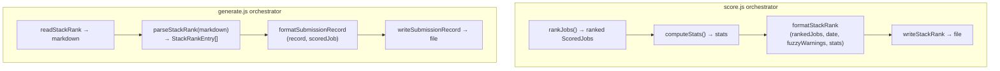

# P2-T03 Plan: `stackRank.js` — StackRank Formatter and Parser

## Overview

Create two files:
1. **`src/models/stackRank.js`** — Three pure functions for formatting/parsing stack rank markdown and submission records
2. **`tests/unit/stackRank.test.js`** — Unit tests with 90% coverage threshold

Update `jest.config.js` to add per-file coverage threshold for `stackRank.js`.

---

## File 1: `src/models/stackRank.js`

### Imports
- `'use strict'`
- `{ formatDateString, formatDateTimeString }` from `'../lib/dateUtils'`
- `module.exports = { formatStackRank, parseStackRank, formatSubmissionRecord }`

### Function 1: `formatStackRank(rankedJobs, date, fuzzyWarnings, stats)`

**Signature:**
```javascript
formatStackRank(
  rankedJobs: ScoredJob[],    // array with rank and actionFlag populated
  date: Date,                 // Date object for header
  fuzzyWarnings: object[],    // [{ job1, job2, reason }] from deduplicator
  stats: object               // { scoreMean, scoreMin, scoreMax, distribution }
): string
```

**Algorithm:**
1. **Compute `docsToGenerate`**: Count `rankedJobs` where `actionFlag !== 'NO_DOCS'`
2. **Build header**:
   - `# Stack Rank — ${formatDateString(date)}`
   - Empty line
   - `*Generated: ${formatDateTimeString(new Date())} | Jobs scored: ${rankedJobs.length} | Documents to generate: ${docsToGenerate}*`
   - `*Score stats: mean ${stats.scoreMean?.toFixed(1) ?? '—'} | range ${stats.scoreMin ?? '—'}–${stats.scoreMax ?? '—'} | distribution: 1-3: ${stats.distribution?.['1-3'] ?? 0} | 4-5: ${stats.distribution?.['4-5'] ?? 0} | 6-7: ${stats.distribution?.['6-7'] ?? 0} | 8-10: ${stats.distribution?.['8-10'] ?? 0}*`
3. **Build fuzzy warning block** (if `fuzzyWarnings.length > 0`):
   - Empty line
   - For each warning: `⚠️ **Possible duplicate:** "${job1.company} — ${job1.title}" appears at 2 different URLs. Verify before generating.`
4. **Build job entries** (iterating `rankedJobs` in order):
   - Empty line
   - Map `actionFlag` to emoji+text string:
     - `'DEEP_TAILOR'` → `🔴 DEEP TAILOR`
     - `'AUTO_GENERATED'` → `🟡 AUTO-GENERATED`
     - `'NO_DOCS'` → `⚪ NO DOCS`
   - `## ${rank}. [${score}/10] [${flagText}] — ${company} | ${title}`
   - `**Source file:** ${filename}`
   - `**LinkedIn Job ID:** ${linkedInJobId ?? 'Not available'}`
   - `**URL:** ${url}`
   - Build location line: `**Location:** ${location} | **Employment Type:** ${employmentType}` + (if `salary !== null`) ` | **Salary:** ${salary}`
   - `**Harvested:** ${formatDateTimeString(harvested)}`
   - Empty line
   - `**Fit:** ${fitSignal}`
   - `**Gap:** ${gap}`
   - Empty line
   - `---`
5. Return assembled string (trimmed)

### Function 2: `parseStackRank(markdown)`

**Signature:**
```javascript
parseStackRank(markdown: string): StackRankEntry[]
```

**Algorithm:**
1. Use regex to find all job entry blocks. Each entry starts with `## \d+. ` and ends at `---`.
2. For each entry, extract:
   - `rank`: number from `## (\d+).`
   - `score`: number from `\[(\d+)/10\]`
   - `actionFlag`: from emoji pattern — `🔴 DEEP TAILOR` → `'DEEP_TAILOR'`, `🟡 AUTO-GENERATED` → `'AUTO_GENERATED'`, `⚪ NO DOCS` → `'NO_DOCS'`
   - `company`: text before ` | ` in the heading after `] — `
   - `title`: text after ` | ` in the heading
   - `sourceFilename`: text after `**Source file:** `
   - `linkedInJobId`: text after `**LinkedIn Job ID:** ` (or `null` if "Not available")
   - `url`: text after `**URL:** `
3. **Filter**: Return ONLY entries where `actionFlag === 'DEEP_TAILOR'` or `actionFlag === 'AUTO_GENERATED'`
4. Return the filtered array

**Regex approach for parsing entries:**
```
/## (\d+)\. \[(\d+)\/10\] \[(🔴|🟡|⚪) (.+?)\] — (.+?) \| (.+?)\n\*\*Source file:\*\* (.+?)\n\*\*LinkedIn Job ID:\*\* (.+?)\n\*\*URL:\*\* (.+?)\n/g
```
This captures: rank, score, emoji, actionFlagText, company, title, sourceFilename, linkedInJobId, url

### Function 3: `formatSubmissionRecord(record, scoredJob)`

**Signature:**
```javascript
formatSubmissionRecord(
  record: ApplicationRecord,
  scoredJob: ScoredJob
): string
```

**Algorithm:**
1. `# Submission Record — ${record.company} | ${record.title}`
2. Empty line
3. `**Generated:** ${record.dateGenerated}`
4. `**Source JD:** archive/${record.dateGenerated}/${scoredJob.filename}`
5. `**LinkedIn Job ID:** ${record.linkedInJobId ?? 'Not available'}`
6. Map `record.actionFlag` to flag display string
7. `**Score:** ${record.score}/10 | [flagDisplay]`
8. `**Fit:** ${scoredJob.fitSignal}`
9. `**Gap:** ${scoredJob.gap}`
10. Empty line
11. `## Pillars Selected`
12. `${record.pillarsSelected?.length > 0 ? record.pillarsSelected.join(' | ') : '—'}`
13. Empty line
14. `## Cover Letter Structure`
15. Format cover letter paras: `${record.coverLetterParas ?? '—'} paragraphs${coverLetterParas !== null ? ' (body paras)' : ''}`
16. Empty line
17. `## Quality Assessment`
18. `**Resume:** ${record.resumeQuality ?? '—'}/10 | **Cover Letter:** ${record.coverLetterQuality ?? '—'}/10`
19. `**Note:** ${record.qualityNote ?? '—'}`
20. Empty line
21. `## Application Status`
22. `**Date applied:** ${record.dateApplied ?? '—'}`
23. `**Method:** ${record.applicationMethod ?? '—'}`
24. `**Notes:** ${record.notes ?? '—'}`

**Null-safe rendering:** Use `?? '—'` for all nullable fields.

---

## File 2: `tests/unit/stackRank.test.js`

### Test structure

```javascript
'use strict';
const { formatStackRank, parseStackRank, formatSubmissionRecord } = require('../../src/models/stackRank');
const { formatDateString, formatDateTimeString } = require('../../src/lib/dateUtils');
```

### Helper functions

**`makeScoredJob(overrides)`** — Build a scored job fixture replicating the shape from `scoredJob.js`:
```javascript
{
  title: 'Senior Privacy Manager',
  company: 'Meridian Health Systems',
  location: 'Remote',
  employmentType: 'Full-time',
  salary: '$160,000–$185,000',
  url: 'https://www.linkedin.com/jobs/view/3987654321',
  linkedInJobId: '3987654321',
  harvested: new Date('2026-05-30 09:14'),
  description: 'Job description text.',
  filename: 'sample_job_1.md',
  score: 8,
  fitSignal: 'Strong alignment on governance program leadership.',
  gap: 'No direct healthcare domain experience.',
  rank: 1,
  actionFlag: 'DEEP_TAILOR',
  ...overrides,
}
```

**`makeApplicationRecord(overrides)`** — Build an ApplicationRecord fixture:
```javascript
{
  id: '2026-05-30-Meridian-Health-Systems-Senior-Privacy-Manager',
  company: 'Meridian Health Systems',
  title: 'Senior Privacy Manager',
  url: 'https://www.linkedin.com/jobs/view/3987654321',
  linkedInJobId: '3987654321',
  score: 8,
  actionFlag: 'DEEP_TAILOR',
  resumeQuality: 7,
  coverLetterQuality: 6,
  qualityNote: 'Strong pillar selection.',
  pillarsSelected: ['Program Leadership', 'Risk Governance'],
  coverLetterParas: 2,
  outputPath: 'resumes/2026-05-30/Meridian-Health-Systems - Senior-Privacy-Manager/',
  dateGenerated: '2026-05-30',
  dateApplied: null,
  applicationMethod: null,
  status: 'generated',
  notes: '',
  ...overrides,
}
```

### Test: `describe('formatStackRank')`

| # | Test | Input | Expected |
|---|------|-------|----------|
| 1 | renders descending rank order | 2 jobs: rank 1 (score 8), rank 2 (score 6) | Output contains `## 1.` before `## 2.` |
| 2 | renders correct action flags | 1 DEEP_TAILOR, 1 AUTO_GENERATED, 1 NO_DOCS | Contains `🔴 DEEP TAILOR`, `🟡 AUTO-GENERATED`, `⚪ NO DOCS` |
| 3 | includes Source file field | scoredJob with filename | Contains `**Source file:** sample_job_1.md` |
| 4 | includes LinkedIn Job ID field | scoredJob with linkedInJobId | Contains `**LinkedIn Job ID:** 3987654321` |
| 5 | omits Salary line when salary is null | scoredJob with `salary: null` | Contains location+employment type but NOT `**Salary:**` |
| 6 | includes stats line in header | stats object with values | Contains `*Score stats: mean 7.0 | range 6–8 | distribution:` |
| 7 | includes correct document count | 3 jobs: 2 DEEP_TAILOR, 1 NO_DOCS | `Documents to generate: 2` |
| 8 | renders fuzzy warning when non-empty | fuzzyWarnings with 1 entry | Contains `⚠️ **Possible duplicate:**` |
| 9 | no fuzzy warning when empty | fuzzyWarnings: [] | Does NOT contain `⚠️ **Possible duplicate:**` |
| 10 | handles empty rankedJobs array | [] | Valid header with `Jobs scored: 0 | Documents to generate: 0` |

### Test: `describe('parseStackRank')`

| # | Test | Input | Expected |
|---|------|-------|----------|
| 1 | returns only DEEP_TAILOR and AUTO_GENERATED entries | Formatted output with all 3 flag types | Only DEEP_TAILOR and AUTO_GENERATED in result |
| 2 | extracts sourceFilename correctly | Formatted output | Each entry has correct `sourceFilename` |
| 3 | extracts linkedInJobId correctly | Formatted output with mixed null/valid IDs | Correctly extracts IDs, null for "Not available" |
| 4 | returns empty array when no qualifying jobs | Output with only NO_DOCS entries | Empty array |
| 5 | round-trips with formatStackRank | formatStackRank output → parseStackRank | Returns matching entries (lenient comparison ignoring extra fields) |

### Test: `describe('formatSubmissionRecord')`

| # | Test | Input | Expected |
|---|------|-------|----------|
| 1 | contains all required section headers | standard record + scoredJob | Contains `# Submission Record —`, `## Pillars Selected`, `## Cover Letter Structure`, `## Quality Assessment`, `## Application Status` |
| 2 | renders null quality fields as placeholders | record with all quality fields null | Uses `—` for resumeQuality, coverLetterQuality, qualityNote, pillarsSelected (renders as `—`), coverLetterParas |
| 3 | includes company, title, score, fitSignal, gap | standard inputs | Contains company, title, score value, fitSignal text, gap text |

---

## File 3: Update `jest.config.js`

Add to `coverageThreshold`:
```javascript
[path.resolve(__dirname, 'src/models/stackRank.js')]: {
  branches: 90,
  functions: 90,
  lines: 90,
  statements: 90,
},
```

---

## Acceptance Verification

Before switching back, verify:

1. `npm run lint` → 0 errors
2. `npm test` → all suites green (scaffold, job, scoredJob, stackRank)
3. `grep -r "console\." src/models/stackRank.js` → no matches (no bare console calls)
4. Coverage for `stackRank.js` ≥ 90%

---

## Architecture Diagram

```mermaid
flowchart LR
    A[rankedJobs: ScoredJob[]] --> B[formatStackRank]
    C[date: Date] --> B
    D[fuzzyWarnings] --> B
    E[stats] --> B
    B --> F[markdown string]
    F --> G[parseStackRank]
    G --> H[StackRankEntry[]<br/>DEEP_TAILOR + AUTO_GENERATED only]

    I[ApplicationRecord] --> J[formatSubmissionRecord]
    K[ScoredJob] --> J
    J --> L[submission_record.md string]
```

## Function Interaction


