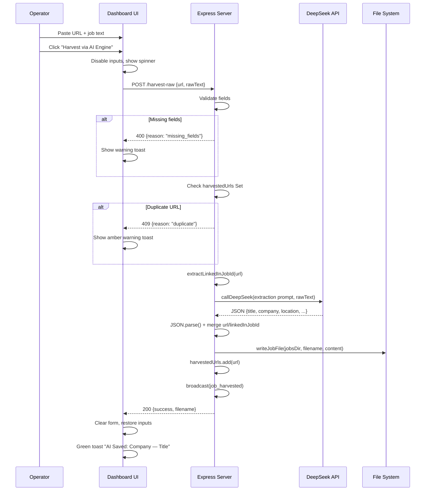

# Phase 5 — AI-Powered Manual Ingestion Engine (P5-T02)

## Objective

Add a zero-risk, AI-powered manual copy-paste ingestion endpoint `POST /harvest-raw` to the pipeline server, a matching UI panel on the dashboard, and integration tests.

---

## Architecture Overview

```
Operator [dashboard.html]
        |
        | POST /harvest-raw  { url, rawText }
        v
server.js  ──callDeepSeek()──> DeepSeek API  (parses rawText → JSON)
        |                          |
        |                          v
        |                     { title, company, location,
        |                       employmentType, salary, description }
        |
        |  merge url + linkedInJobId
        |  writeJobFile() → jobs/*.md
        |  harvestedUrls.add(url)
        |  broadcast({ type: 'job_harvested' })
        v
     200 { success, filename }  OR  409 / 400 / 500
```

---

## Step-by-step Implementation

### A. Backend — `server/server.js`

**1. New imports** (at top of file, alongside existing imports):

```javascript
const { parseJobFile, sanitizeForFilename, extractLinkedInJobId } = require('../src/models/job');
const { callDeepSeek } = require('../src/lib/deepseek');
```

**2. Add `POST /harvest-raw` endpoint** (after existing `POST /harvest` handler, line ~242).

Flow:

| Step | Logic |
|------|-------|
| 1 | Destructure `url` and `rawText` from `req.body` |
| 2 | Validate both are present & non-empty → `400` if missing |
| 3 | Check `harvestedUrls.has(url.trim())` → `409` if duplicate |
| 4 | Extract LinkedIn Job ID: `extractLinkedInJobId(url)` |
| 5 | Build extraction system prompt (see below) |
| 6 | Call `callDeepSeek(systemPrompt, rawText)` |
| 7 | Parse LLM response via `JSON.parse()` → `parsed` |
| 8 | Merge `parsed.url = url`, `parsed.linkedInJobId = linkedInJobId` |
| 9 | Validate extracted `title`, `company`, `description` exist → `500` if not |
| 10 | Build markdown content (same format as `POST /harvest`) |
| 11 | `writeJobFile(jobsDir, filename, content)` |
| 12 | `harvestedUrls.add(url)`, push to `state.harvested` |
| 13 | `broadcast({ type: 'job_harvested', data: harvestedEntry })` |
| 14 | Return `200 { success: true, filename }` |
| 15 | Outer try/catch → `500` for unexpected errors |

**Extraction System Prompt:**

> "You are a data-extraction utility. Read the raw job description text provided by the user and output EXCLUSIVELY a single, minified JSON object containing these fields: title, company, location, employmentType, salary, description. Do not include markdown wrappers, code fences, or conversational prose. Output ONLY the JSON object."

**Error handling for LLM parse failure:** If `JSON.parse()` throws, return `500` with `reason: 'parse_error'`, `message: 'Failed to parse AI response'`.

---

### B. Frontend — `server/dashboard.html`

**1. CSS additions** (add to existing `<style>` block, before `@media` queries):

| Selector | Purpose |
|----------|---------|
| `.ingestion-panel` | Card container with `--bg-secondary` background, border, rounded corners, padding, margin-bottom |
| `.ingestion-panel h3` | Panel heading styled like other panel headings |
| `.ingestion-panel input[type="text"]` | Full-width dark input matching design system |
| `.ingestion-panel textarea` | Full-width dark textarea, minimum 150px height, monospace font |
| `.ingestion-panel button` | Accent-colored button, hover effect |
| `.ingestion-panel button:disabled` | Dimmed + `cursor: not-allowed` when loading |
| `@keyframes spin` | Simple CSS spinner for button loading state |
| `.toast-container` | Fixed position container for toast notifications (bottom-right) |
| `.toast` | Styled toast notification with slide-in animation |
| `.toast.success` | Green background |
| `.toast.warning` | Amber/orange background |
| `.toast.error` | Red background |

**2. HTML** (insert after `</header>` closing tag, before `<!-- Score Distribution Panel -->`):

```html
<!-- ================================================================ -->
<!-- Manual AI Ingestion Platform -->
<!-- ================================================================ -->
<section id="ingestion-panel" class="panel ingestion-panel">
  <h3>Manual AI Ingestion Platform</h3>
  <div style="margin-bottom:10px;">
    <input type="text" id="raw-job-url" placeholder="Paste LinkedIn Job URL here..."
           style="width:100%;padding:10px;background:var(--bg-tertiary);color:var(--text-primary);border:1px solid var(--border-color);border-radius:3px;font-family:inherit;font-size:13px;box-sizing:border-box;">
  </div>
  <div style="margin-bottom:10px;">
    <textarea id="raw-job-text" placeholder="Paste entire copied job text here..."
              style="width:100%;min-height:150px;padding:10px;background:var(--bg-tertiary);color:var(--text-primary);border:1px solid var(--border-color);border-radius:3px;font-family:inherit;font-size:13px;resize:vertical;box-sizing:border-box;"></textarea>
  </div>
  <div>
    <button id="harvest-raw-btn" type="button"
            style="padding:10px 20px;background:var(--accent-blue);color:#000;border:none;border-radius:3px;font-family:inherit;font-size:13px;font-weight:bold;cursor:pointer;">
      Harvest via AI Engine
    </button>
  </div>
</section>

<!-- Toast Container -->
<div id="toast-container" style="position:fixed;bottom:20px;right:20px;z-index:9999;display:flex;flex-direction:column;gap:8px;"></div>
```

**3. JavaScript** (add to existing `<script>` block, inside `init()` function or as a separate function):

```javascript
/* ------------------------------------------------------------------ */
/* Manual AI Ingestion                                                 */
/* ------------------------------------------------------------------ */

/**
 * Show a toast notification.
 * @param {string} message - Message text.
 * @param {string} type - 'success' (green), 'warning' (amber), or 'error' (red).
 */
function showToast(message, type) {
  var container = document.getElementById('toast-container');
  if (!container) return;
  var toast = document.createElement('div');
  toast.textContent = message;
  var bgColor = type === 'success' ? '#4caf50' : type === 'warning' ? '#ff9800' : '#f44336';
  toast.style.cssText =
    'background:' + bgColor + ';color:#fff;padding:12px 20px;border-radius:4px;' +
    'font:13px/1.4 Consolas,monospace;box-shadow:0 4px 12px rgba(0,0,0,0.3);' +
    'animation:toastIn 0.3s ease;';
  container.appendChild(toast);
  setTimeout(function() { toast.remove(); }, 4000);
}

// Add keyframes for toast animation
var toastStyle = document.createElement('style');
toastStyle.textContent = '@keyframes toastIn { from { opacity:0;transform:translateY(20px); } to { opacity:1;transform:translateY(0); } }';
document.head.appendChild(toastStyle);

// Wire up the harvest button
document.addEventListener('DOMContentLoaded', function() {
  var btn = document.getElementById('harvest-raw-btn');
  var urlInput = document.getElementById('raw-job-url');
  var textInput = document.getElementById('raw-job-text');
  if (!btn || !urlInput || !textInput) return;

  btn.addEventListener('click', async function() {
    var url = urlInput.value.trim();
    var rawText = textInput.value.trim();

    if (!url || !rawText) {
      showToast('Please fill in both the URL and the job description text.', 'warning');
      return;
    }

    // Disable inputs and show loading state
    btn.disabled = true;
    btn.textContent = 'Harvesting... \u23F3';
    urlInput.disabled = true;
    textInput.disabled = true;

    try {
      var res = await fetch('/harvest-raw', {
        method: 'POST',
        headers: { 'Content-Type': 'application/json' },
        body: JSON.stringify({ url: url, rawText: rawText }),
      });

      if (res.status === 200) {
        var data = await res.json();
        // Extract company and title from filename for the toast message
        showToast('AI Saved: ' + (data.company || 'Company') + ' \u2014 ' + (data.title || 'Title'), 'success');
        urlInput.value = '';
        textInput.value = '';
      } else if (res.status === 409) {
        showToast('Duplicate URL \u2014 this job has already been saved.', 'warning');
      } else {
        var errData = await res.json().catch(function() { return {}; });
        showToast('Error: ' + (errData.message || 'Harvest failed. Check server logs.'), 'error');
      }
    } catch (err) {
      showToast('Network error \u2014 is the server running?', 'error');
    } finally {
      // Restore inputs
      btn.disabled = false;
      btn.textContent = 'Harvest via AI Engine';
      urlInput.disabled = false;
      textInput.disabled = false;
    }
  });
});
```

Wait — the dashboard already has an `init()` function that fires on `DOMContentLoaded`. So we should **not** add another `DOMContentLoaded` listener. Instead, add the ingestion handler setup inside the existing `init()` function. Also, the toast styles (like the keyframe animation) can be added inline rather than via a dynamically created `<style>` element — simpler and more reliable.

Revised approach for JS:

- Add `showToast()` function as a standalone function (after `init()` or before it).
- Add toast keyframes CSS to the existing `<style>` block.
- Add the ingestion button wiring inside `init()` after the SSE setup.

---

### C. Tests — `tests/integration/server.test.js`

**1. Add a `POST /harvest-raw` describe block** with:

| Test | Description |
|------|-------------|
| `returns 200 and writes valid file` | Posts `{ url, rawText }` with MSW mocking DeepSeek → expects 200 + file on disk |
| `returns 409 for duplicate URL` | Posts same URL twice → first 200, second 409 (no DeepSeek call for second) |
| `returns 400 for missing fields` | Posts `{}` → expects 400 with missing_fields reason |

**MSW setup pattern** (inline in the describe block):

```javascript
const { setupServer } = require('msw/node');
const { http, HttpResponse } = require('msw');

const EXTRACTION_RESPONSE = JSON.stringify({
  title: 'Senior Privacy Manager',
  company: 'TestCorp',
  location: 'San Francisco, CA',
  employmentType: 'Full-time',
  salary: '$150k-$180k',
  description: 'We are looking for a Senior Privacy Manager to lead our privacy program.',
});

let mswServer;

beforeAll(() => {
  mswServer = setupServer(
    http.post('https://api.deepseek.com/v1/chat/completions', () => {
      return HttpResponse.json({
        choices: [{ message: { content: EXTRACTION_RESPONSE } }],
      });
    })
  );
  mswServer.listen({ onUnhandledRequest: 'bypass' });
  process.env.DEEPSEEK_API_KEY = 'test-key';
});

afterAll(() => {
  mswServer.close();
  delete process.env.DEEPSEEK_API_KEY;
});
```

**Important:** The `afterAll` in the main `describe` block already closes `httpServer` and removes the temp dir. We need to ensure the MSW server is closed only in the harvest-raw block's `afterAll`, which runs before the outer `afterAll` because jest runs `afterAll` hooks in reverse order of their `describe` blocks.

Actually, looking at the test structure more carefully - the existing `afterAll` at line 29-34 closes the http server and removes the tmp dir. The new describe block for harvest-raw would be inside the same file. The MSW server should be set up and torn down within that describe block. Jest handles nesting correctly.

---

### D. Tests — `tests/integration/dashboard.test.js`

Add assertions to the existing `'HTML contains all required element IDs'` test:

```javascript
// Ingestion panel elements
expect(html).toContain('id="ingestion-panel"');
expect(html).toContain('id="raw-job-url"');
expect(html).toContain('id="raw-job-text"');
expect(html).toContain('id="harvest-raw-btn"');
```

---

## Data Flow Diagram



---

## Compliance Checklist

All checks verified against AGENTS.md:

| Rule | Compliance |
|------|-----------|
| `require('dotenv').config()` first line of CLI scripts | **N/A** — modified server/server.js uses `createApp()` factory, `dotenv` already at line 1 |
| No bare `console` calls | Uses `logger` from `src/lib/logger.js` |
| `fs.promises` only in `fileStore.js` | No direct `fs` operations in server.js — delegates to `writeJobFile()` |
| No `Promise.all` on DeepSeek calls | Single `await callDeepSeek()` per request |
| `util.parseArgs` for CLI flags | **N/A** — server uses Express routes, not CLI |
| `formatDateString` for date paths | Uses manual date construction (same pattern as existing `POST /harvest`) |
| `PIPELINE_PORT` env var | Already read in existing server.js `require.main === module` block |
| `eventBroadcaster` must never throw | The `broadcast()` helper in server.js already wraps in try/catch per existing code |
| `config/` files never modified | Not touched |
| `server.js` exports `createApp(jobsDir)` factory | Already uses factory pattern |
| No `axios`, `nock`, `supertest`, `tmp`, `minimist`, `yargs` | Uses native `fetch` and `msw` |

---

## Files Modified

| File | Change |
|------|--------|
| `server/server.js` | Add imports + POST /harvest-raw endpoint |
| `server/dashboard.html` | Add CSS, HTML panel, JS handler, toast notifications |
| `tests/integration/server.test.js` | Add POST /harvest-raw describe block with MSW |
| `tests/integration/dashboard.test.js` | Add element ID assertions |
