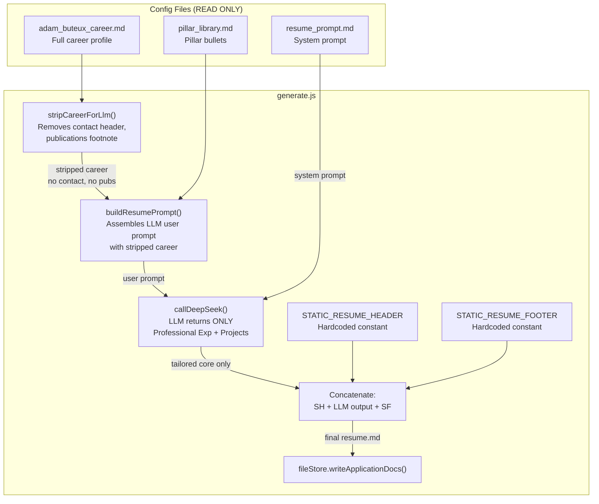

# Plan: Isolate Static Resume Boilerplate from LLM Generation Loop

## Problem

The resume generator (`generate.js`) sends the **entire career profile** (contact header, professional summary, full work history, education, certifications, publications) to the LLM and asks it to generate a complete resume from scratch. This gives the LLM freedom to:

- Scramble or drop the static **Name/Contact Header**
- Drop or rewrite the **Executive Introduction**
- Mutate **Publication URLs**
- Truncate the **Education** and **Certifications** sections due to token limits

## Solution: Hybrid Assembly Pattern

Decompose the final resume into three concatenated blocks, with only the middle block generated by the LLM:

```
finalResumeMarkdown = staticHeader + '\n\n' + llmTailoredCore + '\n\n' + staticFooter
```

---

## Design Decisions

| Issue | Decision | Rationale |
|-------|----------|-----------|
| Where to store header/footer content? | **Hardcoded constants** in `generate.js` | The project rule forbids creating/modifying `config/` files. Header/footer content is permanent and belongs in the orchestrator. |
| What goes in the LLM prompt? | Only the **Professional Experience** and **Independent Projects** portions of the career file. Contact details and publications reference are stripped. | Prevents the LLM from mutating static data. Reduces token consumption. |
| What does the LLM output? | Only exact markdown for `## PROFESSIONAL EXPERIENCE` and `## INDEPENDENT PROJECTS` sections. | Clear contract: LLM only owns the tailored core. |
| Education / Certifications? | Included in the **static footer** alongside Publications. | These are permanent credentials — no LLM tailoring needed. |
| `buildResumePrompt` changes? | Add a **`stripCareerForLlm` helper** that strips the contact header block and the publications footnote, then passes the stripped career content to `buildResumePrompt`. | Keeps `buildResumePrompt` as a pure function; the stripping logic lives in the orchestrator where it belongs. |

---

## Files to Modify

### 1. `generate.js` — Three assembly phases + career stripping

**a) Add hardcoded static header (`STATIC_RESUME_HEADER`)**

Contains the exact markdown that must appear at the top of every resume:

```markdown
# Adam Buteux, MBA, CISSP, CIPM
Portland, Oregon (open to relocation) | adam@adambuteux.com | 929-218-3981 | [linkedin.com/in/adambuteux](https://www.linkedin.com/in/adambuteux)

Most compliance leaders come from legal. I came from software engineering, with ten years of building enterprise applications before I moved into privacy and risk. That background changes how I work: at Meta, I used my technical fluency to design the classification framework that unblocked a DMA certification. At Audible, I built the privacy program from scratch, secured funding, and personally ran the technical assessment of 500+ applications.

---
```

(Sourced from current `config/resume_prompt.md` section 8)

**b) Add hardcoded static footer (`STATIC_RESUME_FOOTER`)**

Contains Education, Certifications, and Publications sections:

```markdown
---
## EDUCATION

**Executive MBA** — Bayes Business School, London
**BSc Computer Science with Management** — King's College London

---

## CERTIFICATIONS

**Active:** CISSP | CIPM

---

## PUBLICATIONS

*(To be populated — see adam_buteux_supplementary.md)*
```

**c) Add `stripCareerForLlm(careerContents)` helper**

Strips lines from `careerContents` that contain contact information and the publications footnote. Implementation approach:

- Remove from the start of the file down through the first `---` separator (strips the contact header block: name, title, location, email, phone, LinkedIn, Substack)
- Remove the trailing publications footnote line (contains `adam_buteux_supplementary.md`)
- Return the remaining content (professional summary, work experience, education, certifications, frameworks)

**d) Modify the resume generation block (step 9c in the loop)**

Before: `callDeepSeek(resumeSystemPrompt, buildResumePrompt(careerContents, ...))`

After:
```javascript
const llmTailoredCore = await callDeepSeek(
  resumeSystemPrompt,
  buildResumePrompt(stripCareerForLlm(careerContents), pillarContents, scoredJob),
  { maxTokens: 2000, timeoutMs: 60000 }
);

// Hybrid assembly
const resumeContent = `${STATIC_RESUME_HEADER}\n\n${llmTailoredCore}\n\n${STATIC_RESUME_FOOTER}`;
```

**e) Update `RESUMES_DIR` constant check** — No changes needed; write path is unchanged.

### 2. `src/lib/promptBuilder.js` — Optional: stricter output instruction

**Option A** (minimal change): No changes to `buildResumePrompt` itself. The career stripping happens in `generate.js` before the prompt is built. The system prompt (`resume_prompt.md`) already instructs the LLM on output format.

**Option B** (recommended): Add a parameter to `buildResumePrompt` that appends an output format instruction:

```javascript
function buildResumePrompt(careerContents, pillarContents, scoredJob, outputInstruction) {
  // ... existing validation ...
  return [
    'CAREER HISTORY:',
    '',
    careerContents,
    '',
    'PILLAR LIBRARY:',
    '',
    pillarContents,
    '',
    'JOB DESCRIPTION:',
    '',
    scoredJob.description,
    '',
    'FIT SIGNAL:',
    scoredJob.fitSignal,
    '',
    'GAP:',
    scoredJob.gap,
    '',
    outputInstruction || 'OUTPUT ONLY the Professional Experience and Independent Projects sections in clean markdown.',
  ].join('\n');
}
```

This makes the output format requirement explicit at the prompt level, reducing LLM variance.

### 3. `config/resume_prompt.md` — READ but do NOT modify

The rule forbids modifying config files. The system prompt already contains the header architecture instructions. After the refactor, the LLM will only see the stripped career content, so it physically cannot output a header/publications section — even if the system prompt tells it to. The system prompt will eventually become slightly misleading (it still references `## PUBLICATIONS` as an H2), but that's harmless since the LLM won't receive the data to populate those sections.

**Open question for the user**: Should we eventually update `config/resume_prompt.md` to remove the header/publications formatting rules, or leave it as-is since the career stripping achieves the goal?

### 4. `tests/e2e/generate.test.js` — Update temp config and assertions

**a) Add header and footer to temp config setup**

The `setupTempDir` function in the test creates mock config files. Since we're using hardcoded constants instead of config files, we don't need to create new config files in the test. Instead:

**b) Update `CAREER_CONTENT` in the test**

The mock career content should be changed to include a realistic contact header block (which `stripCareerForLlm` will strip), to verify the stripping logic works correctly:

```javascript
const CAREER_CONTENT = `# Adam Buteux, MBA, CISSP, CIPM
Portland, Oregon

## Professional Summary
Senior governance and privacy professional with 15+ years driving compliance programs at scale.

## Professional Experience
### Meta | Senior Manager, Privacy & Risk Review | June 2022–November 2025
Led enterprise AI risk review across Facebook, Instagram, and Messenger.

## Education
Executive MBA — Bayes Business School, London

## Certifications
CISSP | CIPM`;
```

**c) Update mock resume response in the test (indirectly via msw)**

The msw mock returns `RESUME_RESPONSE_CONTENT` which currently includes header + experience + projects + education + certs. After refactor, the mock response must output **only** the Professional Experience and Independent Projects sections (the "tailored core"). The test setup already writes a separate `resume_header.md`-equivalent... actually, since we're hardcoding the header in `generate.js`, the test needs to import or replicate that constant.

**Key test assertions that must still pass:**
- `resume1.toContain('Adam Buteux')` — works because `STATIC_RESUME_HEADER` contains the name
- `resume1.toContain('Portland, Oregon')` — same reason
- Generated files exist at expected paths

**d) Add a new test** that verifies the static header appears verbatim in the output, and that the static footer (EDUCATION, CERTIFICATIONS, PUBLICATIONS) sections appear as-is.

### 5. `tests/helpers/msw-generate-setup.js` — Update mock resume response

The `RESUME_RESPONSE_CONTENT` constant currently returns a full resume. It must be changed to return **only the tailored core** (Professional Experience + Independent Projects sections):

```javascript
const RESUME_RESPONSE_CONTENT = `## PROFESSIONAL EXPERIENCE

### Meta
#### Senior Manager, Privacy & Risk Review — June 2022–November 2025
*Led enterprise AI risk review across Facebook, Instagram, and Messenger.*
- **Reduced regulatory response time by 40%.** Redesigned the DMA compliance workflow across 10 product teams, cutting average cycle from 21 to 12 days.

### Audible (Amazon)
#### Director, Privacy Operations — January 2019–May 2022
*Oversaw global privacy program for 35M+ subscriber platform.*
- **Achieved GDPR certification ahead of deadline.** Delivered data mapping and consent infrastructure 3 months early across 6 workstreams.

### PwC Advisory
#### Director, Risk, Cybersecurity, and Privacy — March 2015–December 2018
*Privacy and GRC engagements for Fortune 500 clients.*
- **Built privacy program from scratch for a $4B healthcare client.** HIPAA-compliant governance framework adopted across 12 business units.

## INDEPENDENT PROJECTS

### RiskHelper.ai
#### Co-Founder & Head of Product — December 2025–Present
AI governance SaaS; product strategy, compliance framework, go-to-market.`;
```

The msw handler routing logic (`PILLAR LIBRARY:` detection) doesn't need to change — it already correctly routes to the resume handler when the user prompt contains `PILLAR LIBRARY:`.

---

## Data Flow Diagram



---

## Test Impact Analysis

| Test | Impact | Required Change |
|------|--------|-----------------|
| Test 1: generates resume/CL/submission | `resume1.toContain('Adam Buteux')` still passes because static header is concatenated. | Update mock `RESUME_RESPONSE_CONTENT` to return only core sections. |
| Test 1: `resume1.toContain('Adam Buteux')` | Still passes. | None needed at assertion level. |
| Test 2: No output for NO_DOCS | Unchanged. | None. |
| Test 3: Idempotent | Unchanged. | None. |
| Test 4: Missing source file | Unchanged. | None. |
| Test 5: Exit 1 with date hint | Unchanged. | None. |
| Test 6: Exit 1 missing configs | Unchanged. | None. |
| Test 7: Quality fail doesn't block | Unchanged. | None. |
| Test 8: Preserves existing records | Unchanged. | None. |
| Test 9: Correct fields in app records | Unchanged. | None. |
| Test 10: doc_generated event | Unchanged. | None. |
| Test 11: --date flag | Unchanged. | None. |
| Test 12: Progress logging | Unchanged. | None. |
| **New test needed** | Verify static header/footer appear verbatim | Add assertion checking that output resume contains exact header text and footer sections. |

---

## Execution Order

1. **Modify `generate.js`** — Add `STATIC_RESUME_HEADER` and `STATIC_RESUME_FOOTER` constants, add `stripCareerForLlm()` helper, modify the resume generation block to use hybrid assembly
2. **Modify `src/lib/promptBuilder.js`** — Add optional `outputInstruction` parameter to `buildResumePrompt()` (Option B above)
3. **Update `tests/helpers/msw-generate-setup.js`** — Change `RESUME_RESPONSE_CONTENT` to return only tailored core sections
4. **Update `tests/e2e/generate.test.js`** — Add new test for static header/footer verification, update mock career content if needed
5. **Run lint + test** — Verify `npm run lint` and `npm test` both pass
