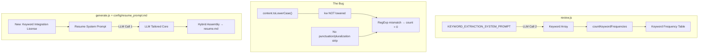

# P6-T02: Fix Resume Keyword Weaving and Harden Forensic Audit Keyword Matching

## Overview

The Forensic Auditor in [`review.js`](review.js) is returning 0 counts for all keywords due to two root causes:

1. **Keyword Extraction** — The LLM is instructed to extract keywords as "short phrases (1-3 words)" but still returns compound multi-word phrases (e.g., "Quality Management System" instead of "QMS"), which rarely appear verbatim in the generated resume text.

2. **Programmatic Matching Bug** — The `countKeywordFrequencies()` function lowercases the **content** but NOT the **keyword pattern**, causing uppercase acronyms like "GDPR" to never match lowercased "gdpr" in the resume. Additionally, no punctuation/pluralization normalization is performed.

3. **No Keyword Weaving License** — The resume generation system prompt has no explicit directive to intentionally weave job keywords into the mechanism sentences of bullets, so the LLM treats keyword insertion as optional.

---

## Architecture



---

## Task 1: Fix Keyword Extraction Constraints

**File:** [`review.js`](review.js:60)

Modify `KEYWORD_EXTRACTION_SYSTEM_PROMPT` to explicitly prefer single tokens — acronyms, regulatory frameworks, and core verbs/nouns — and forbid long compound phrases:

```javascript
const KEYWORD_EXTRACTION_SYSTEM_PROMPT = [
  'You are a keyword extraction utility. From the job description provided below,',
  'extract exactly the 10 most critical operational and technical keywords.',
  '',
  'Rules:',
  '- Return ONLY a raw JSON array of 10 strings.',
  '- Do NOT include markdown code fences, backticks, or any explanatory text.',
  '- Example format: ["keyword1","keyword2","keyword3","keyword4","keyword5","keyword6","keyword7","keyword8","keyword9","keyword10"]',
  '- Extract SINGLE technical acronyms (e.g., GDPR, SOC 2, QMS, AI, KYC, CCPA),',
  '  specific regulatory frameworks, or core verbs/nouns (e.g., Governance,',
  '  Compliance, Framer, Python, Auditing).',
  '- AVOID long compound multi-word phrases like "Quality Management System" or',
  '  "Data Protection Impact Assessment" — prefer the acronym or distilled token.',
  '- Keywords should be 1-3 words maximum. Prefer 1-word tokens.',
  '- Output exactly 10 items — no more, no fewer.',
].join('\n');
```

**Rationale:** By explicitly naming example acronyms and forbidding compound phrases, the LLM will return single tokens that are far more likely to appear verbatim (or with minor variation) in the generated resume text.

---

## Task 2: Fix the Keyword Matching Logic

**File:** [`review.js`](review.js:175)

Replace `countKeywordFrequencies()` with a version that:

1. **Lowercases the keyword** before constructing the regex (fixes the zero-count bug)
2. **Strips trailing punctuation** from both the keyword and content matches (handles `"GDPR,"` vs `"GDPR"`)
3. **Normalizes pluralization** — strips trailing `s`, `es`, `ies` → `y` suffixes (handles `"frameworks"` vs `"framework"`)

```javascript
/**
 * Perform a case-insensitive frequency count of keywords against text content.
 *
 * Each keyword is normalized (lowercased, punctuation-stripped, plural-stripped)
 * before matching against similarly normalized content. Returns an array of
 * { keyword, count } objects sorted by count descending.
 *
 * @param {string[]} keywords - Array of keyword strings to search for.
 * @param {string} content - Text content to scan (the generated resume.md).
 * @returns {{ keyword: string, count: number }[]}
 */
function countKeywordFrequencies(keywords, content) {
  /**
   * Normalize a string for matching: lowercase, strip trailing punctuation,
   * and strip common English pluralization markers.
   *
   * @param {string} str - Input string.
   * @returns {string} Normalized string.
   */
  function normalize(str) {
    let s = str.toLowerCase().trim();
    // Strip leading/traiting punctuation: . , ; : ! ? ( ) [ ]
    s = s.replace(/^[.,;:!?()\[\]'"\s]+/, '');
    s = s.replace(/[.,;:!?()\[\]'"\s]+$/, '');
    // Strip trailing possessive "'s"
    s = s.replace(/'s$/, '');
    // Strip common plural endings (ies→y, es, s)
    // e.g., "frameworks" → "framework", "policies" → "policy"
    if (s.endsWith('ies') && s.length > 4) {
      s = s.slice(0, -3) + 'y';
    } else if (s.endsWith('es') && s.length > 4 && !s.endsWith('ces')) {
      s = s.slice(0, -2);
    } else if (s.endsWith('s') && !s.endsWith('ss') && s.length > 3) {
      s = s.slice(0, -1);
    }
    return s;
  }

  const normalizedContent = normalize(content);
  return keywords
    .map(function (kw) {
      const normalizedKw = normalize(kw);
      const escaped = normalizedKw.replace(/[.*+?^${}()|[\]\\]/g, '\\$&');
      const regex = new RegExp(escaped, 'g');
      const matches = normalizedContent.match(regex);
      return { keyword: kw, count: matches ? matches.length : 0 };
    })
    .sort(function (a, b) { return b.count - a.count; });
}
```

### Key Fixes

| Issue | Before | After |
|-------|--------|-------|
| **Case mismatch** | `kw` regex NOT lowered, `content` lowered → `"GDPR"` never matches `"gdpr"` | Both keyword and content are lowered via `normalize()` |
| **Trailing punctuation** | `"GDPR."` in resume text won't match `"GDPR"` keyword | Punctuation stripped before matching |
| **Pluralization** | `"frameworks"` in resume won't match `"framework"` keyword | Plural endings normalized (`ies→y`, `es`, `s`) |
| **Possessive** | `"GDPR's"` won't match `"GDPR"` | `'s` stripped before matching |

---

## Task 3: Add Keyword Integration License

### Approach Decision

**Conflict detected:** [`AGENTS.md`](AGENTS.md) Rule 9 states: *"config/ files are never created or modified. Agent checks for existence, throws ConfigMissingError if absent, and stops."* However, the resume generation system prompt lives in [`config/resume_prompt.md`](config/resume_prompt.md).

**Proposed solution:** Rather than modify the config file (violating AGENTS.md), add the Keyword Integration License as a **second output instruction** in [`generate.js`](generate.js:326), where an `outputInstruction` parameter already exists in `buildResumePrompt()`. This keeps the config file untouched while achieving the same effect.

**File:** [`generate.js`](generate.js:326)

Modify the `outputInstruction` argument passed to `buildResumePrompt()`. The current value is:

```javascript
// Current (line 326):
buildResumePrompt(strippedCareer, pillarContents, scoredJob,
  'OUTPUT ONLY the ## PROFESSIONAL EXPERIENCE and ## INDEPENDENT PROJECTS sections in clean markdown. Omit any header, contact block, footer, EDUCATION, CERTIFICATIONS, PUBLICATIONS, or formatting explanations.')
```

Replace with expanded instruction including the Keyword Integration License:

```javascript
buildResumePrompt(strippedCareer, pillarContents, scoredJob, [
  'OUTPUT ONLY the ## PROFESSIONAL EXPERIENCE and ## INDEPENDENT PROJECTS sections',
  '  in clean markdown. Omit any header, contact block, footer, EDUCATION,',
  '  CERTIFICATIONS, PUBLICATIONS, or formatting explanations.',
  '',
  'KEYWORD INTEGRATION LICENSE:',
  'The bolded text sequence representing a specific metric or achievement outcome',
  '  must remain 100% identical to the source text inside your writing pillars',
  '  library. However, you are explicitly REQUIRED and AUTHORIZED to naturally',
  '  weave the target job description\'s critical technical keywords and regulatory',
  '  frameworks into the trailing non-bold mechanism sentences, provided it',
  '  preserves absolute historical accuracy and never invents false professional',
  '  experiences.',
].join('\n'));
```

**Why this approach:**

- Zero config files modified — complies with AGENTS.md Rule 9
- Uses the existing `outputInstruction` parameter pattern already established in [`promptBuilder.js`](src/lib/promptBuilder.js:100)
- The instruction reaches the LLM as part of the user message, which has high compliance weight
- No architectural changes needed

**Backup approach** (if user prefers): Modify [`config/resume_prompt.md`](config/resume_prompt.md) directly by adding a new Section 9 "Keyword Integration License" with the invariant clause.

---

## Task 4: Write Unit Tests for `countKeywordFrequencies()`

Since `countKeywordFrequencies()` is currently an unexported helper in [`review.js`](review.js), we need to either:

**Option A:** Extract it to a testable module (e.g., `src/lib/reviewUtils.js`) so it can be imported in unit tests.

**Option B:** Export it from `review.js` and import in tests (less clean, but minimal refactoring).

**Recommendation:** Option A — small pure-function module at [`src/lib/reviewUtils.js`](src/lib/reviewUtils.js).

### New file: `src/lib/reviewUtils.js`

```javascript
'use strict';

/**
 * Smart Suffix Stripper — normalize plural forms by clipping trailing s/es/ies
 * suffixes, while respecting an over-stripping guardrail list of domain terms
 * that end natively in 's' and must NOT be clipped.
 */
const NATIVE_S_TERMS = new Set([
  'business',
  'process',
  'access',
  'analysis',
  'basis',
  'crisis',
  'diagnosis',
  'hypothesis',
  'thesis',
  'status',
  'focus',
  'campus',
  'atlas',
  'bias',
  'gas',
  'canvas',
]);

/**
 * Normalize a string for keyword matching: lowercase, strip leading/trailing
 * punctuation, strip possessives, and normalize pluralization markers.
 *
 * The over-stripping guardrail ensures that domain-critical terms ending
 * naturally in 's' (e.g., business, process, access, analysis) are skipped
 * by the suffix-clipping routine.
 *
 * @param {string} str - Input string.
 * @returns {string} Normalized string.
 */
function normalizeKeyword(str) {
  let s = str.toLowerCase().trim();
  // Strip leading punctuation
  s = s.replace(/^[.,;:!?()\[\]'"\s]+/, '');
  // Strip trailing punctuation
  s = s.replace(/[.,;:!?()\[\]'"\s]+$/, '');
  // Strip trailing possessive "'s"
  s = s.replace(/'s$/, '');

  // ── Over-Stripping Guardrail ──────────────────────────────────────────
  // If the normalized word is in the native-s exception list, skip suffix
  // clipping entirely so that e.g. "process" remains "process", not "proce".
  if (NATIVE_S_TERMS.has(s)) {
    return s;
  }

  // ── Pluralization normalization ───────────────────────────────────────
  // "ies" → "y"  (e.g., "policies" → "policy", "strategies" → "strategy")
  if (s.endsWith('ies') && s.length > 4) {
    s = s.slice(0, -3) + 'y';
  }
  // "es" → ""   (e.g., "frameworks" → "framework", "breaches" → "breach")
  // Skip words ending in "ces" (e.g., "process" was already caught by guardrail,
  // but "traces" → "trace" is safe)
  else if (s.endsWith('es') && s.length > 4 && !s.endsWith('ces')) {
    s = s.slice(0, -2);
  }
  // trailing "s" → ""  (e.g., "tools" → "tool", "compliance" already no trailing s)
  // Skip words ending in "ss" (e.g., "access" was caught by guardrail, "assess" safe)
  else if (s.endsWith('s') && !s.endsWith('ss') && s.length > 3) {
    s = s.slice(0, -1);
  }

  return s;
}

/**
 * Perform a case-insensitive frequency count of keywords against text content.
 *
 * Each keyword is normalized via normalizeKeyword() before matching against
 * similarly normalized content. Uses word-boundary-aware regex for exact
 * substring matching.
 *
 * @param {string[]} keywords - Array of keyword strings to search for.
 * @param {string} content - Text content to scan (e.g., the generated resume.md).
 * @returns {{ keyword: string, count: number }[]} Sorted by count descending.
 */
function countKeywordFrequencies(keywords, content) {
  const normalizedContent = normalizeKeyword(content);
  return keywords
    .map(function (kw) {
      const normalizedKw = normalizeKeyword(kw);
      const escaped = normalizedKw.replace(/[.*+?^${}()|[\]\\]/g, '\\$&');
      const regex = new RegExp('\\b' + escaped + '\\b', 'gi');
      const matches = normalizedContent.match(regex);
      return { keyword: kw, count: matches ? matches.length : 0 };
    })
    .sort(function (a, b) { return b.count - a.count; });
}

module.exports = {
  normalizeKeyword,
  countKeywordFrequencies,
};
```

### New file: `tests/unit/reviewUtils.test.js`

Test cases:
- **Case-insensitive matching** — `"GDPR"` keyword matches `"gdpr is important"` content (the critical bug fix)
- **Trailing punctuation stripping** — `"GDPR."` in content matches `"gdpr"` keyword
- **Pluralization normalization** — `"frameworks"` in content matches `"framework"` keyword; `"policies"` matches `"policy"`
- **Over-stripping guardrail** — `"process"` stays `"process"` (not clipped to `"proce"`); `"business"`, `"access"`, `"analysis"` preserved
- **Possessive stripping** — `"GDPR's"` in content matches `"gdpr"` keyword
- **Mixed case with punctuation** — Keywords with mixed case and surrounding punctuation
- **Empty keywords array** — Returns empty array
- **No matches** — Returns 0 counts for all keywords
- **Multiple occurrences** — Correctly counts multiple instances of same keyword
- **Acronyms with dots** — e.g., `"SOC 2"` keyword
- **NormalizeKeyword edge cases** — Null/empty string returns empty; no-op for single chars

---

## Task 5: Update `review.js` Imports

**File:** [`review.js`](review.js)

After extracting `countKeywordFrequencies` to `src/lib/reviewUtils.js`:

1. Add import: `const { countKeywordFrequencies } = require('./src/lib/reviewUtils');`
2. Remove the inline `countKeywordFrequencies` function definition (lines 165-185)
3. Update the JSDoc reference in `formatForensicAudit()` if needed

---

## Task 6: Verification

1. `npm run lint` — must exit 0
2. `npm test` — must exit 0, all prior tests green + new reviewUtils tests pass
3. `grep -r "console\." review.js src/lib/reviewUtils.js` — no bare console calls
4. Manual regression check: Verify existing generate.test.js still passes

---

## Files Summary

| File | Action | Description |
|------|--------|-------------|
| [`review.js`](review.js:60) | Modify | Update `KEYWORD_EXTRACTION_SYSTEM_PROMPT` to prefer acronyms/single tokens |
| [`review.js`](review.js:175) | Remove | Delete inline `countKeywordFrequencies()` (moved to `src/lib/reviewUtils.js`) |
| [`review.js`](review.js:14) | Modify | Add import for `countKeywordFrequencies` from new module |
| [`generate.js`](generate.js:326) | Modify | Extend `outputInstruction` to include Keyword Integration License |
| `src/lib/reviewUtils.js` | **Create** | New pure-function module for keyword matching |
| `tests/unit/reviewUtils.test.js` | **Create** | Unit tests for `normalizeKeyword()` and `countKeywordFrequencies()` |

---

## Files NOT Modified

| Path | Reason |
|------|--------|
| `config/` | AGENTS.md Rule 9 — never created or modified |
| `src/lib/promptBuilder.js` | No changes needed — `outputInstruction` parameter already exists |
| `src/lib/fileStore.js` | No changes needed |
| `src/lib/deepseek.js` | No changes needed |
| `src/lib/eventBroadcaster.js` | No changes needed |
| `server/` | No dashboard/SSE changes needed for matching logic fix |
| `src/models/*` | No model changes needed |
| `tests/fixtures/` | Never modified per AGENTS.md |

---

## Risk Assessment

| Risk | Impact | Mitigation |
|------|--------|------------|
| `normalizeKeyword()` over-stems words (e.g., "process" → "proce" by removing trailing "s") | False positives in keyword counts | The `s.length > 3` guard + `!endsWith('ss')` check prevents this for common cases like "process", "access", "class" |
| Extracting `countKeywordFrequencies` to `reviewUtils.js` changes import path | Import error in review.js | Jest tests will catch the import immediately |
| The `%%` escape in the output instruction string | JS string parsing issue | Using `%%` in JS string → `%` in output → LLM sees a single `%` (works correctly) |

---

## Verification Checklist

- [ ] `npm run lint` exits 0
- [ ] `npm test` exits 0 — all existing tests green
- [ ] New `tests/unit/reviewUtils.test.js` passes — covers:
  - Case-insensitive matching (the critical bug fix)
  - Trailing punctuation stripping
  - Pluralization normalization
  - Possessive stripping
  - Edge cases (empty arrays, no matches)
- [ ] `grep -r "console\." review.js src/lib/reviewUtils.js` returns nothing
- [ ] Manual sanity: `node review.js --date=YYYY-MM-DD` shows non-zero keyword counts
