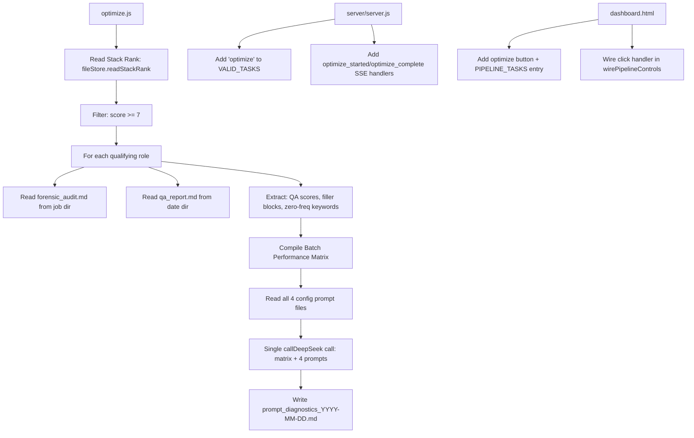

# Plan: Implement "Analyze Prompt Performance" Meta-Prompt Optimization (`optimize.js`)

## Overview

Create a root-level meta-analysis script `optimize.js` that scans daily batch output metadata, isolates performance trends from high-scoring roles (score >= 7), reviews system prompt files against forensic audit critiques, and recommends manual configuration updates.

---

## Architecture



---

## Detailed Steps

### P1 — Add new fileStore methods [`src/lib/fileStore.js`](src/lib/fileStore.js:345)

Add two new exported methods:

```javascript
/**
 * Read a forensic_audit.md file from a job's output directory.
 *
 * @param {string} resumesDir - Path to the resumes directory.
 * @param {string} dateStr - Date string in "YYYY-MM-DD" format.
 * @param {string} company - Company name (raw — will be sanitized).
 * @param {string} title - Job title (raw — will be sanitized).
 * @returns {Promise<string>} The file content.
 * @throws {Error} If the file is not found.
 */
async function readForensicAudit(resumesDir, dateStr, company, title) { ... }

/**
 * Read a qa_report.md file from a dated output directory.
 *
 * @param {string} resumesDir - Path to the resumes directory.
 * @param {string} dateStr - Date string in "YYYY-MM-DD" format.
 * @returns {Promise<string>} The file content.
 * @throws {Error} If the file is not found.
 */
async function readQaReport(resumesDir, dateStr) { ... }
```

Both use `sanitizeForFilename` and `path.join` — mirroring the pattern from [`writeForensicAudit()`](src/lib/fileStore.js:335).

Also add a `writePromptDiagnostics()` method:

```javascript
/**
 * Write the prompt diagnostics report to a dated output directory.
 *
 * @param {string} resumesDir - Path to the resumes directory.
 * @param {string} dateStr - Date string in "YYYY-MM-DD" format.
 * @param {string} content - Markdown report content.
 * @returns {Promise<string>} The full path written.
 */
async function writePromptDiagnostics(resumesDir, dateStr, content) { ... }
```

Update `module.exports` to include all three new methods.

---

### P2 — Create [`optimize.js`](optimize.js) (new root-level script)

Follow the exact pattern of [`review.js`](review.js) — the most structurally similar existing script.

**File structure:**

```
'use strict';
require('dotenv').config();                     // Line 1
const { parseArgs } = require('util');          // CLI flag parsing
const path = require('path');
const { promises: fs } = require('fs');

// Project imports
const { ConfigMissingError } = require('./src/lib/errors');
const logger = require('./src/lib/logger');
const { formatDateString } = require('./src/lib/dateUtils');
const { broadcastEvent } = require('./src/lib/eventBroadcaster');
const fileStore = require('./src/lib/fileStore');
const { callDeepSeek } = require('./src/lib/deepseek');
const { parseJobFile, sanitizeForFilename } = require('./src/models/job');
const { parseStackRank } = require('./src/models/stackRank');
```

**Constants:**
```
const ROOT_DIR = process.env.PIPELINE_BASE_DIR || __dirname;
const CONFIG_DIR = path.join(ROOT_DIR, 'config');
const RESUMES_DIR = path.join(ROOT_DIR, 'resumes');
const JOBS_DIR = path.join(ROOT_DIR, 'jobs');
```

**Main flow (`async function main()`):**

1. **Parse CLI args** — `--date` flag via `parseArgs`, same as review.js
2. **Read stack rank** — `fileStore.readStackRank(RESUMES_DIR, dateStr)`
3. **Parse qualifying jobs** — `parseStackRank(stackRankContent)` to get structured entries
4. **High-Pass Filter** — Filter entries where `entry.score >= 7` (scores 7, 8, 9, 10)
5. **Broadcast `optimize_started`** — with `{ total: filteredJobs.length, date: dateStr }`
6. **Read job files** — OPTIMIZED I/O: read once into Map before loop
7. **Read all 4 config prompts** — via `fileStore.readConfig()`:
   - `scoring_prompt.md` → `scoringPrompt`
   - `resume_prompt.md` → `resumePrompt`
   - `cover_letter_prompt.md` → `clPrompt`
   - `quality_prompt.md` → `qualityPrompt`
8. **Per-job loop** (sequential, NO `Promise.all`):
   - a. Retrieve job file from Map, parse it for description
   - b. Compute output directory via `getOutputDir()` (same helper pattern as review.js)
   - c. Read `forensic_audit.md` via `fileStore.readForensicAudit()`
   - d. Read QA evaluation scores from `qa_report.md` (if available)
   - e. **Extract from forensic_audit.md:**
     - QA evaluation score percentage values (line-by-line scan for percentage patterns like `85%`)
     - Exact text lists of unlinked filler blocks (from `## Filler & Over-Qualification Analysis` section)
     - Names of critical keywords with frequency count of 0 (from `## Keyword Frequency Table`)
   - f. Broadcast `job_optimized` event per job
   - g. Log progress with ETA
9. **Compile Batch Performance Matrix** — Format all extracted data into a compact markdown summary matrix table:
   - Column: Company, Title, Score, QA Score, Filler Warnings, Zero-Freq Keywords
   - No raw resume/cover letter text is included
10. **Single DeepSeek call** — `callDeepSeek()` with:
    - System prompt instructing DeepSeek to analyze the gap patterns
    - User prompt containing: Batch Performance Matrix + all 4 prompt content strings
    - Instruct to output actionable optimization recommendations in markdown
    - Options: `{ maxTokens: 2000, timeoutMs: 60000 }`
11. **Write diagnostics report** — `fileStore.writePromptDiagnostics(RESUMES_DIR, dateStr, llmResponse)`
12. **Broadcast `optimize_complete`** — with `{ optimized: filteredJobs.length }`
13. **Log completion**

**Key helper functions:**

```javascript
function getOutputDir(resumesDir, dateStr, company, title) { ... }
  // Same impl as review.js:114-119

function extractQaScore(auditContent) { ... }
  // Parse QA evaluation score percentage from forensic_audit.md header/body

function extractFillerBlocks(auditContent) { ... }
  // Extract text lines from ## Filler & Over-Qualification Analysis section

function extractZeroFreqKeywords(auditContent) { ... }
  // Parse ## Keyword Frequency Table, return keywords with count 0

function buildBatchMatrix(optimizedData) { ... }
  // Format array of per-job extracted data into compact markdown summary table

function buildOptimizePrompt(batchMatrix, scoringPrompt, resumePrompt, clPrompt, qualityPrompt) { ... }
  // Combine batch matrix + 4 prompts into a single user prompt for DeepSeek
```

**Context Compression Constraint:** The `buildBatchMatrix()` function MUST NOT include raw resume or cover letter text. Only compact structured data (scores, lists of filler blocks, zero-frequency keyword names).

**Read-Only Guarantee:** The script NEVER writes to `applications.json`, `config/` directory, or job output directories. It only reads from them.

---

### P3 — Update [`server/server.js`](server/server.js)

**3a — Add `'optimize'` to VALID_TASKS** (line 681):
```javascript
const VALID_TASKS = ['score', 'generate', 'qa', 'cleanup', 'review', 'optimize'];
```

**3b — Add SSE event handling** in the POST `/event` handler (after `review_complete` case, around line 567):
```javascript
case 'optimize_started':
  state.phase = 'optimizing';
  break;

case 'job_optimized':
  // No persistent state mutation — broadcast only
  break;

case 'optimize_complete':
  state.phase = 'idle';
  break;
```

**3c — Handle optimize process close** in the `child.on('close', ...)` callback (after review handling, around line 748):
```javascript
if (code === 0 && task === 'optimize') {
  state.phase = 'idle';
  broadcast({ type: 'state', data: state });
  logger.info('[server]', `Optimize complete — broadcast state snapshot`);
}
```

---

### P4 — Update [`server/dashboard.html`](server/dashboard.html)

**4a — Add CSS for optimize button** (after `.pipeline-btn.run-review` styles, around line 655):
```css
.pipeline-btn.run-optimize {
  background: #00bcd4;
  color: #000;
}
.pipeline-btn.run-optimize:hover:not(:disabled) {
  background: #4dd0e1;
}
```

**4b — Add button to Pipeline Operations Center** (after the cleanup button, around line 951):
```html
<button id="pipeline-btn-optimize" type="button" class="pipeline-btn run-optimize">
  <span class="spinner"></span>
  &#9654; Analyze Prompt Performance
</button>
```

**4c — Add to PIPELINE_TASKS** (around line 2057):
```javascript
optimize: { btnId: 'pipeline-btn-optimize', label: 'Prompt Optimizer' },
```

**4d — Wire click handler** in `wirePipelineControls()` (after cleanup button wiring, around line 2320):
```javascript
var optimizeBtn = document.getElementById('pipeline-btn-optimize');
if (optimizeBtn) {
  optimizeBtn.addEventListener('click', function() {
    startPipelineTask('optimize');
  });
}
```

**4e — Handle `'optimizing'` phase** in `updateHeader()` (around line 1065):
```javascript
if (phase === 'optimizing') label = '\u2699\uFE0F Analyzing Prompt Performance...';
```

---

### P5 — Update [`package.json`](package.json:21)

Add to the `"scripts"` section:
```json
"optimize": "node optimize.js"
```

---

### P6 — Validation

Run:
```bash
npm run lint       # Must exit 0
npm test           # Must exit 0, all prior tests green
grep -r "console\." src/ optimize.js
grep -n "Promise.all" optimize.js
```

Also verify:
- No writes to `applications.json` or `config/` directory
- All logging goes through `logger.info/warn/error`
- `fs.promises` is used (not `fs.readFileSync` etc.)
- `parseArgs` is used for CLI flags

---

## File Change Summary

| File | Action | Description |
|------|--------|-------------|
| `src/lib/fileStore.js` | **Edit** | Add `readForensicAudit`, `readQaReport`, `writePromptDiagnostics` methods + exports |
| `optimize.js` | **Create** | Root-level meta-analysis CLI script |
| `server/server.js` | **Edit** | Register 'optimize' task + SSE events + close handler |
| `server/dashboard.html` | **Edit** | Add button, CSS, PIPELINE_TASKS entry, wirePipelineControls wiring, updateHeader |
| `package.json` | **Edit** | Add `"optimize": "node optimize.js"` script alias |

---

## Risk Assessment

| Risk | Mitigation |
|------|------------|
| `forensic_audit.md` or `qa_report.md` may not exist for all qualifying jobs | Wrap reads in try/catch, skip gracefully with logger.warn + broadcastEvent |
| QA report format varies | Parse with flexible regex patterns (percentage match). Missing = null |
| DeepSeek response is malformed | Use try/catch on call, fallback to error message in report |
| High-scoring jobs may have been cleaned up already | Check source file existence in Map, skip with logger.warn if missing |
| `optimize` button enables during running state | Automatically handled by `setPipelineButtonsDisabled(true/false)` in `startPipelineTask`/`finishPipelineTask` |
