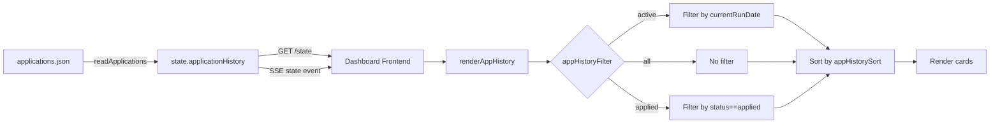

# P8 — Application History Filter & Sort

## Objective

Add two capabilities to the Application History panel:

1. **Filter**: Show only jobs that have been applied for (`status === 'applied'`)
2. **Sort**: Sort by company name, score, date generated, or date applied

All changes are **client-side only** within `server/dashboard.html` — no backend (`server.js`) changes needed, since the full `state.applicationHistory` array is already available to the front-end via `/state` and SSE.

---

## Current Architecture

- [`server/dashboard.html`](server/dashboard.html) — Single-file frontend (all CSS/JS inline)
- [`server/server.js`](server/server.js) — Backend, serves `/state` endpoint with full `state.applicationHistory` array
- Filter state: `appHistoryFilter` variable (values: `'active'` | `'all'`)
- Current filters: two buttons — "Active Run Only" and "View Full Ledger"
- No sorting exists — cards render in whatever order `state.applicationHistory` arrives (insertion order from `applications.json`)

---

## Changes

### 1. Add "Applied Only" filter button

**Location**: dashboard.html, the `.app-history-filters` button group (lines 913-916)

Add a third `<button>`:
```html
<button type="button" class="filter-btn" data-filter="applied">Applied Only</button>
```

**State variable**: `appHistoryFilter` (line 1651) — add `'applied'` as a valid value.

**`setAppHistoryFilter()`** (line 1375) — update validation to accept `'applied'` alongside `'active'` and `'all'`.

**`renderAppHistory()`** (line 1266) — add a third branch before the sorting step:
```javascript
if (appHistoryFilter === 'applied') {
  displayHistory = history.filter(function(rec) {
    return rec.status === 'applied';
  });
}
```

### 2. Add sort controls

**Location**: dashboard.html, inside the `.app-history-header` div (lines 428-433), after the filter buttons.

Add a `<select>` dropdown:
```html
<select id="app-history-sort" class="sort-select">
  <option value="default">Sort: Default</option>
  <option value="company">Sort: Company A-Z</option>
  <option value="score">Sort: Score (high-low)</option>
  <option value="dateGenerated">Sort: Date Generated (newest)</option>
  <option value="dateApplied">Sort: Date Applied (newest)</option>
</select>
```

**CSS** for the sort select — matches filter button styling:
```css
.sort-select {
  background: var(--bg-secondary);
  color: var(--text-primary);
  border: 1px solid var(--border-color);
  border-radius: 4px;
  padding: 6px 10px;
  font-family: inherit;
  font-size: 11px;
  cursor: pointer;
  flex-shrink: 0;
}
.sort-select:hover {
  background: var(--bg-tertiary);
}
.sort-select:focus {
  outline: none;
  border-color: var(--accent-blue);
}
```

**State variable**: `appHistorySort` — stores the current sort key (default: `'default'`).

### 3. Update `renderAppHistory()` to apply sorting

After the filter step and before the card rendering loop (around line 1298), insert a sort step:

```javascript
// Apply sort
if (appHistorySort !== 'default') {
  displayHistory.sort(function(a, b) {
    switch (appHistorySort) {
      case 'company':
        return (a.company || '').localeCompare(b.company || '');
      case 'score':
        return (b.score ?? 0) - (a.score ?? 0);
      case 'dateGenerated':
        return (b.dateGenerated || '').localeCompare(a.dateGenerated || '');
      case 'dateApplied':
        var aDate = a.dateApplied || '';
        var bDate = b.dateApplied || '';
        // Sort applied dates descending; nulls go to bottom
        if (aDate === '' && bDate === '') return 0;
        if (aDate === '') return 1;
        if (bDate === '') return -1;
        return bDate.localeCompare(aDate);
      default:
        return 0;
    }
  });
}
```

### 4. Wire the sort control

Add a `wireAppHistorySort()` function (new):

```javascript
function wireAppHistorySort() {
  var sortSelect = document.getElementById('app-history-sort');
  if (!sortSelect) return;

  sortSelect.addEventListener('change', function() {
    appHistorySort = sortSelect.value;
    // Re-fetch state and re-render
    fetch('/state')
      .then(function(res) { return res.json(); })
      .then(function(state) {
        renderAppHistory(state.applicationHistory || []);
      })
      .catch(function() {
        addDebugLog('appHistorySort: failed to fetch state', 'error');
      });
  });
}
```

Call `wireAppHistorySort()` in the `init()` function (around line 1872).

### 5. Preserve sort when filter changes

The `setAppHistoryFilter()` function already re-fetches state and re-renders via `renderAppHistory()`. The `renderAppHistory()` function reads the global `appHistorySort` variable, so no additional wiring is needed — changing the filter will re-render with the current sort applied.

### 6. Handle empty states for "Applied Only"

When `appHistoryFilter === 'applied'` and no records match, show:
```
"No applications have been marked as applied yet."
```

---

## No Backend Changes

The backend ([`server/server.js`](server/server.js)) needs **no modifications** because:

- `GET /state` already returns the full `state.applicationHistory` array
- Filtering and sorting are pure client-side operations
- The SSE stream already delivers the full history on initial connect via the `state` event
- The `POST /api/applications/apply` endpoint already updates `state.applicationHistory` in memory, which then gets re-broadcast to clients

---

## Files Modified

| File | Change |
|------|--------|
| `server/dashboard.html` | All front-end changes — new filter button, sort dropdown, updated render logic, new wiring function |

---

## Test Plan

The existing [`tests/integration/dashboard.test.js`](tests/integration/dashboard.test.js) verifies HTML element IDs exist in the served HTML. Add assertions for:

1. `data-filter="applied"` — ensures the "Applied Only" button is present
2. `id="app-history-sort"` — ensures the sort dropdown is present
3. `<option value="company"` — verifies all sort options exist

No integration tests needed for the sort/filter logic itself (it's pure client-side JS, tested implicitly by manual verification).

---

## Mermaid Diagram — Data Flow



---

## Files to Read Reference

- [`server/dashboard.html`](server/dashboard.html:1266) — `renderAppHistory()` function (line 1266)
- [`server/dashboard.html`](server/dashboard.html:1375) — `setAppHistoryFilter()` function (line 1375)
- [`server/dashboard.html`](server/dashboard.html:1643) — State variables (line 1651)
- [`server/dashboard.html`](server/dashboard.html:1908) — `wireAppHistoryFilters()` (line 1908)
- [`server/dashboard.html`](server/dashboard.html:1867) — `init()` function wiring (line 1867)
- [`server/dashboard.html`](server/dashboard.html:426) — App history header / filter HTML (line 428)
- [`src/models/applicationRecord.js`](src/models/applicationRecord.js:25) — ApplicationRecord data shape

---

## Implementation Order

1. Add the "Applied Only" filter button HTML
2. Add the sort dropdown HTML
3. Add CSS for the sort select
4. Add `appHistorySort` state variable
5. Update `renderAppHistory()` with filter + sort logic
6. Update `setAppHistoryFilter()` validation
7. Implement `wireAppHistorySort()` and call it from `init()`
8. Update empty states for the applied filter
9. Update dashboard test for new element IDs
10. Run lint + tests, verify manual
